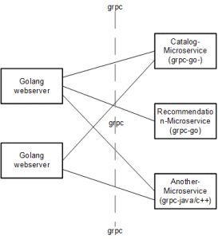

# Go dan Microservices

## Memahami Microservices

## Arsitektur Microservices

## Go dan Microservices

Bagaimana serta peranti apa saja yang diperlukan untuk mengimplementasikan microservices di Go

## Microservices di Go Menggunakan GoKit

## Microservices di Go Menggunakan grpc

Microservices telah menjadi kata kunci sejak tahun lalu dan banyak arsitek yang mengeksplorasi manfaat yang mereka bisa dapatkan dengan menggunakan itu. Tapi harus dapat diekspos sebagai microservices, mencoba untuk sebanyak mungkin dan mengurangi jumlah proses pada sistem.
Saya merasa bahwa Go benar-benar baik dan menawarkan fleksibilitas yang lebih baik sebagai ukuran proses, tampaknya lebih rendah daripada bahasa lainnya. Saya melihat minimal overhead kurang. artcile ini bukan tentang mengapa MICROSERVICE & bagaimana seharusnya Anda memilih layanan Anda?saya ingin menempatkan bagaimana Anda dapat menulis webapplication berdasarkan MICROSERVICE di golang menggunakan grpc. Memilih dua layanan 1) layanan Katalog 2) Rekomendasi layanan sebagaimana microservices. webapplication yang dibangun menggunakan go. Webapplicaiton di golang, dua microservices di backend.<1>

Web Server (main.go): Anda dapat membuat server web di golang dengan sangat sedikit garis ... Di bawah ini adalah kode ..

~~~bash
http.HandleFunc(“/catalog”, GetProductCatalog)
http.Handle(“/”, http.FileServer(http.Dir(“public”)))
http.ListenAndServe(“:8080”, nil)
~~~

 proto3 adalah versi yang digunakan dalam file penyangga protokol grpc .Three diciptakan dan dimasukkan ke dalam direktori "proto".
Kode go sesuai dihasilkan dengan menjalankan perintah "protoc -aku ../protos ../protos/*.proto -go_out = plugin = grpc: basicwebapp". Saya telah memeriksa di file yang dihasilkan juga untuk memudahkan pemahaman.

CatalogServer / CatalogServiceServer:
 Proses go adalah CatalogServicesServer dan melayani "layanan katalog". Anda harus dapat menavigasi ke folder "CatalogServer" dalam kode sumber di github
menjalankan "pergi membangun CatalogServiceServer.go" di commandline. Jika Anda berhasil maka catalogserviceserver.exe akan dihasilkan. menjalankannya untuk memulai server. Tujuan utama dari MICROSERVICE ini adalah untuk memberikan produk.

~~~bash
    service CatalogService {

    rpc GetProductCatalog(CatalogRequest) returns (CatalogResponse) {}

    }

    message Category {

    string categoryName=1;
    }

    message CatalogResponse {

    repeated Product products =1;

    }

    message CatalogRequest {

    Category category=1;
    }
~~~

File penyangga protokol yang menyatakan metode rpc dan serialisasi format dalam folder "proto" ... di bawah ini adalah inti dari itu ..

~~~bash    service RecommendationService {

    rpc GetRecommendations(Product) returns (RecommendationResponse);
    }
    message RecommendationResponse{

    message Recommendation{

    int32 rating =1;

    int32 productid=2;
    }
    repeated Recommendation result=1;

    }
~~~

Complile server rekomendasi dan menjalankannya sebelum menjalankan webserver ..

Komunikasi antara server grpc dan webserver:

1. Jalankan main.go

2. Jenis localhost: 8080 di browser .. Anda harus dapat melihat halaman html dengan tombol submit seperti di bawah ini.

Dengan mengklik tombol submit akan dikirimkan ke server. Path target "katalog" sehingga akan ditangani oleh fungsi callback getproductcatalog. Cari kode di bawah ini di fungsi yang bertanggung jawab untuk memanggil MICROSERVICE ..
~~~bash
    conn, err := grpc.Dial(catalogServerAddress, opts…) //DIaling in to the catalogServerAddress “port is hardcoded at 50052”

    if err !=nil {
    log.Fatal(“fail to dial %v”, err)
    }

    defer conn.Close()

    client := pb.NewCatalogServiceClient(conn) // Create new Catalogserviceclient stub.
    stream, err := client.GetProductCatalog(context.Background(), &pb.CatalogRequest{&pb.Category{CategoryName:”Computer”}}) // Invoke the remote method “GetProductCatalog” and get the response into stream variable..
	~~~
	
Sumber : <1>https://devicharan.wordpress.com/2015/04/12/microservices-based-webapplication-in-golang-using-grpc/
source code :  https://github.com/devicharan/basicwebapp
[grpc](http://grpc.io)

introduction :

bab 1. Taufik Nur Rakhaman/145410215 ## Memahami Microservices
bab 2. Angga Ibnu Saputra/115410162 ## Arsitektur Microservices dan Microservices di Go Menggunakan grpc
bab 3. Fendi Djatmiko/145410203 ## Microservices di Go Menggunakan GoKitGo
bab 4. Yandri W.Sironga/125410215 ## go dan Microservices

